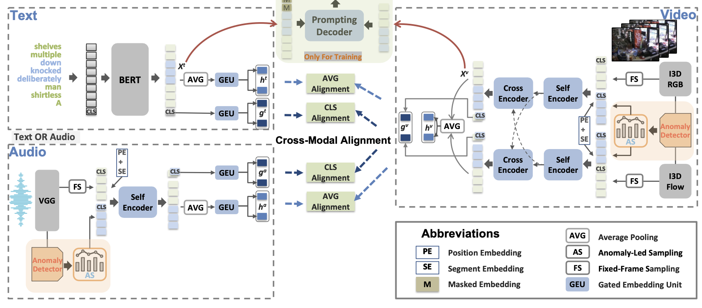

# VAR
This is the official project website of our paper:
**Towards Video Anomaly Retrieval from Video Anomaly Detection: New Benchmarks and Model**  
> Peng Wu, Jing Liu _Senior Member, IEEE_, Xiangteng He, Yuxin Peng _Senior Member, IEEE_, Peng Wang, and Yanning Zhang _Senior Member, IEEE_



## UCF-Crime Captions
UCFCrime-AR Captions are released to facilitate future research.
## Features
[I3D features of UCFCrime-AR](https://stuxidianeducn-my.sharepoint.com/:f:/g/personal/pengwu_stu_xidian_edu_cn/EvYcZ5rQZClGs_no2g-B0jcB4ynsonVQIreHIojNnUmPyA?e=xNrGxc)

[I3D&VGGish features of XDViolence-AR](https://roc-ng.github.io/XD-Violence/)

## Highlight
- We introduce a new task named video anomaly retrieval to bridge the gap between the literature and real-world applications in terms of video anomaly analysis. To our knowledge, this is the first work moves towards VAR from VAD;
- We present two large-scale benchmarks, i.e., UCFCrime- AR and XDViolence-AR, based on public VAD datasets. The former is applied to video-text VAR, the latter is to video-audio VAR;
- We propose a model called ALAN, aiming at challenges in VAR, where anomaly-led sampling, video prompt based masked phrase modeling, and cross-modal align- ment are introduced for the attention of anomalous segments, enhancement of fine-grained associations, and multi-perspective match, respectively.


## Citation

If you find this repo useful for your research, please consider citing our paper:

```bibtex
@article{wu2023towards,
  title={Towards Video Anomaly Retrieval from Video Anomaly Detection: New Benchmarks and Model},
  author={Wu, Peng and Liu, Jing and He, Xiangteng and Peng, Yuxin and Wang, Peng and Zhang, Yanning},
  journal={arXiv preprint arXiv:2307.12545},
  year={2023}
}
```
---
